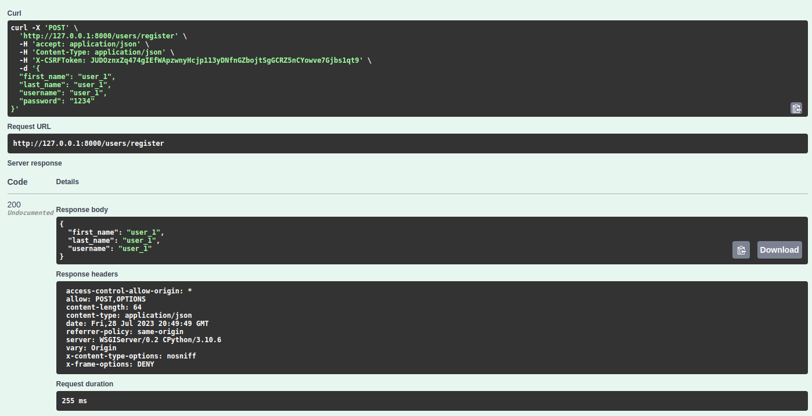
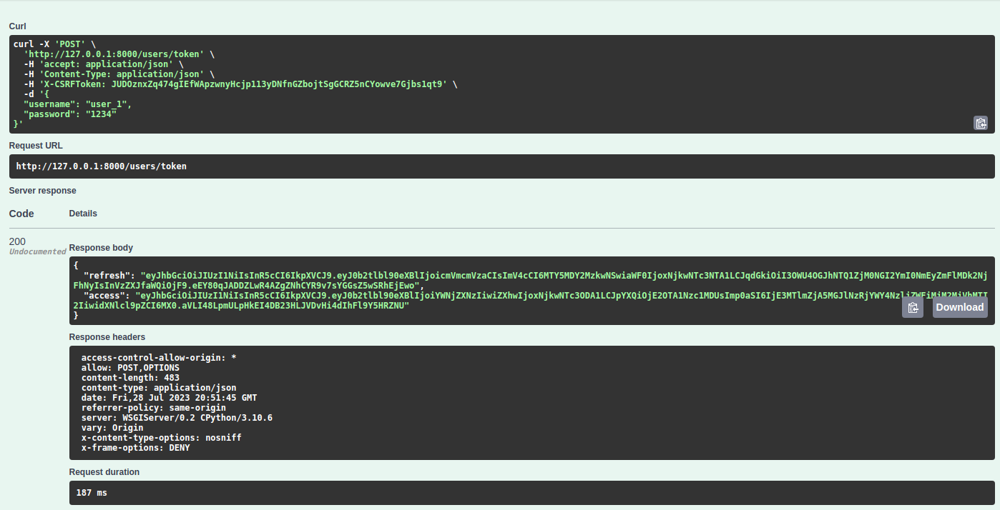
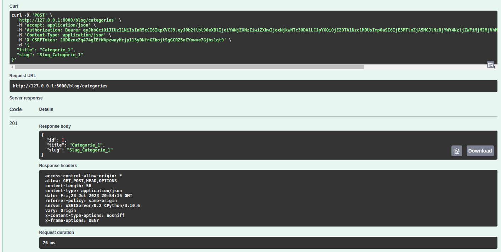
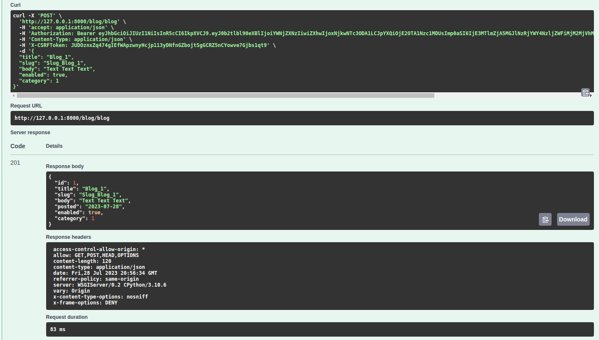
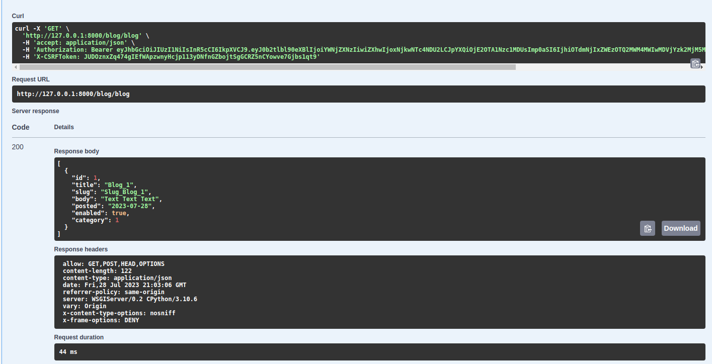
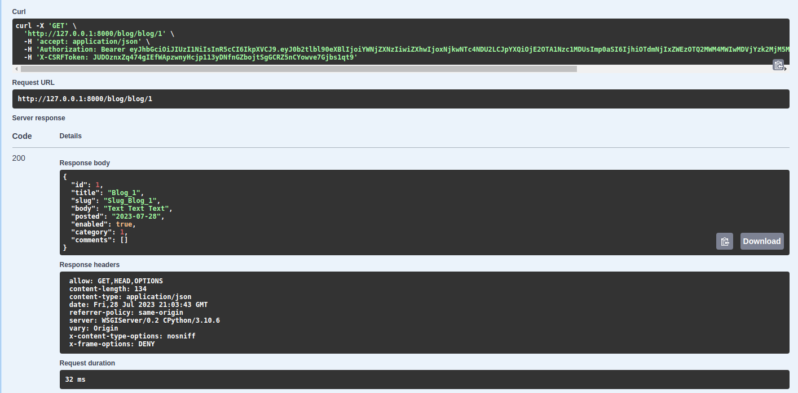

# Django Rest Framework - Internship tasks

The project consists of 4 parts. Each part is in its own branch.

#### Project requirements
* [Python 3.10](https://docs.python.org/3.10)
* [Django 3.2](https://docs.djangoproject.com/en/3.2)

### First steps to run the project

Some steps before start work on tasks.

https://docs.djangoproject.com/en/3.2/intro/install/

1. Install python requirements ```pip install -r requirements.txt```
2. Database is SQLite, local, and execute ```python manage.py migrate```
3. Start the project ```python manage.py runserver```
4. Open website and register a user in /users/register endpoint
5. Login with registered credentials in /users/token endpoint
6. In swagger click "Authorize" button and type ```Bearer <access token from response>```
7. Let's do first milestone!

### Milestone 1

1. Add the enabled field to the Blog model:
In the models.py file, modify the Blog model to include the enabled field.

```bash
class Blog(models.Model):
    ...
    enabled = models.BooleanField(default=True) 

```
2. Open in Django Admin (access /admin website section) and add in Blog list the real blog name and status (enabled/disabled): In the admin.py file, register the Blog model and customize its display.

```bash
class BlogAdmin(admin.ModelAdmin):
    list_display = ('title', 'enabled')

```
3. Make an endpoint for create a blog post (similar as register endpoint) that will add a new record in blog table.
In the views.py file, in the module the BlogListView add a post request.
```bash
 def post(self, request):
        serializer = BlogSerializer(data=request.data)
        if serializer.is_valid():
            serializer.save()
            return Response(serializer.data, status=status.HTTP_201_CREATED)
        return Response(serializer.errors, status=status.HTTP_400_BAD_REQUEST)
```
Import module status from rest_framework.

4. Create a new model ```Comments``` with ```text``` and ```blog``` foreign key, here we will save comments for each blog post. 
In the models.py file, define the Comment model with a text field and a foreign key to the Blog model.

```bash
class Comment(models.Model):
    text = models.TextField()
    blog = models.ForeignKey(Blog, on_delete=models.CASCADE, related_name='comments')

```
5. Add Comments for management in Django Admin:
```bash

class CommentAdmin(admin.ModelAdmin):
    list_display = ('text', 'blog') 

admin.site.register(Comment, CommentAdmin)
```
6. Create an endpoint that creates a comment to a blog post (input: blog_id, text)
In the serializers.py file, you need to create a serializer for the newly added Comment model. 
```bash

class CommentSerializer(serializers.ModelSerializer):
    class Meta:
        model = Comment
        fields = "__all__"
```
In the views.py file, create a new view to handle adding comments.
```bash
class CommentCreateView(GenericAPIView):
    serializer_class = CommentSerializer 

    def post(self, request):
        serializer = CommentSerializer(data=request.data)
        if serializer.is_valid():
            serializer.save()
            return Response(serializer.data, status=status.HTTP_201_CREATED)
        return Response(serializer.errors, status=status.HTTP_400_BAD_REQUEST)


```
7. In endpoint ```/blog/blog/{id}``` return the Blog post object and list of comments.
In the views.py file, update the BlogItemView:
```bash
class BlogItemView(GenericAPIView):
    serializer_class = BlogSerializer
    permission_classes = ( IsAuthenticated,)

    def get(self, request, pk):
        blog = get_object_or_404(Blog.objects.filter(pk=pk))
        blog_data = BlogSerializer(blog).data

        
        comments = Comment.objects.filter(blog=blog)
        comment_data = CommentSerializer(comments, many=True).data

    
        blog_data['comments'] = comment_data
        return Response(blog_data)

```

<a href="foto_results/1_post_users_register.png" target="_blank">
  
</a>
<a href="foto_results/2_post_users_token.png" target="_blank">
  
</a>
<a href="foto_results/3_post_blog_categories.png" target="_blank">
  
</a>
<a href="foto_results/4_post_blog_blog.png" target="_blank">
  
</a>
<a href="foto_results/5_get_blog_blog.png" target="_blank">
  
</a>
</a>
<a href="foto_results/6_post_blog_blog_1.png" target="_blank">
  
</a>
